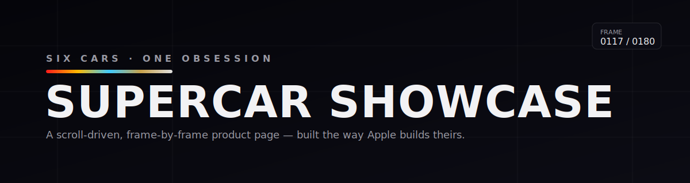
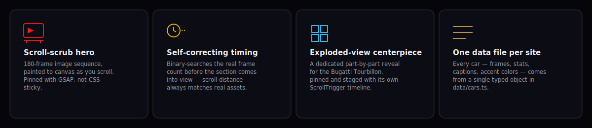
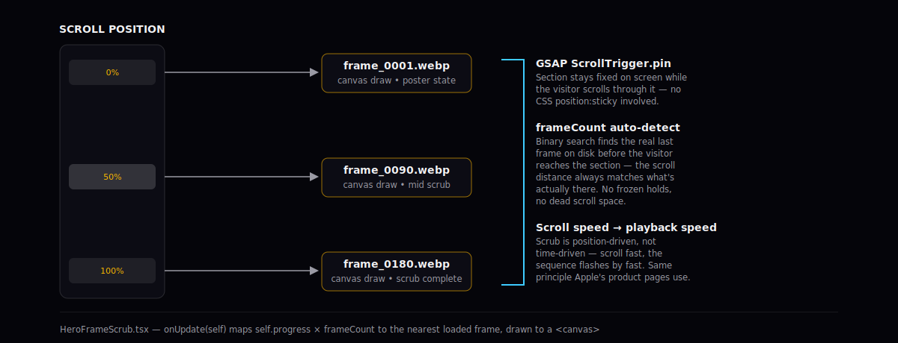
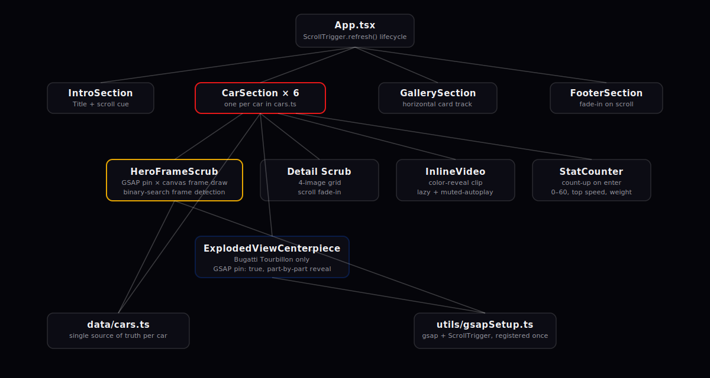

<div align="center">



<br/>

[](https://github.com/<you>/<repo>/actions/workflows/ci.yml)
[](https://react.dev)
[](https://www.typescriptlang.org)
[](https://vitejs.dev)
[](https://gsap.com)
[](#license)

**A scroll-driven, frame-by-frame supercar showcase — built the way Apple builds theirs.**

[Quick Start](#quick-start) · [How the Scrub Works](#how-the-scroll-scrub-works) · [Architecture](#architecture)

</div>

<br/>

## What this is

Six cars, one page, zero video files in the hero. Every hero is a sequence of still frames painted onto a `<canvas>` in perfect sync with scroll position — the same technique behind Apple's product pages — plus a scroll-fading detail gallery, a count-up spec panel, an inline color-reveal clip, and a dedicated exploded-view centerpiece for the Bugatti Tourbillon.

There is no backend. Every visual beat on the page is derived from one typed data file (`src/data/cars.ts`) and driven by scroll position through [GSAP ScrollTrigger](https://gsap.com/docs/v3/Plugins/ScrollTrigger/).

<br/>

## Features



<br/>

## How the scroll-scrub works



The short version:

1. `HeroFrameScrub` pins its section with `ScrollTrigger`'s own `pin: true` — not CSS `position: sticky`, which turned out to be too fragile in practice (breaks under any ancestor `overflow`, needs vendor-prefixing on older WebKit, misbehaves with mobile viewport resizing).
2. As you scroll through the pinned distance, `onUpdate(self)` maps `self.progress` to a frame index and draws that frame to a canvas.
3. Before the section ever comes into view, a fast binary search (~8 requests instead of loading all 180 frames) finds the *real* last frame that exists on disk. If a car's folder has fewer frames than configured, the pinned scroll distance shrinks to match — so nobody is ever left scrolling through a stretch where the image has already frozen.
4. Playback speed is entirely a function of scroll speed, by design — scroll fast and the sequence flashes by fast, exactly like Apple's own pages. It's not a video with a fixed runtime.

<br/>

## Architecture



| Component | Responsibility |
|---|---|
| `App.tsx` | Renders the six `CarSection`s from `cars.ts`, refreshes `ScrollTrigger` once fonts/images settle |
| `HeroFrameScrub` | Pinned scroll-scrub hero — canvas frame drawing, auto frame-count detection |
| `CarSection` | Per-car layout: hero, detail grid, color-reveal clip, stat panel |
| `ExplodedViewCenterpiece` | Bugatti-only part-by-part reveal, pinned with its own timeline |
| `InlineVideo` | Lazy, muted-autoplay color-reveal clip with a poster fallback |
| `StatCounter` | Count-up animation for 0–60, top speed, horsepower, weight |
| `GallerySection` | Horizontal scrollable card track, one per car |
| `FooterSection` | Simple fade-in on scroll |

<br/>

## Quick start

```bash
git clone https://github.com/<you>/<repo>.git
cd <repo>
npm install
npm run dev       # http://localhost:5173
```

| Command | What it does |
|---|---|
| `npm run dev` | Local dev server with hot reload |
| `npm run build` | Type-checks (`tsc -b`) then builds to `dist/` |
| `npm run preview` | Serves the production build locally |
| `npm run lint` | Runs `oxlint` |

<br/>

## Asset pipeline

Every car needs the following under `public/assets/`:

```
public/assets/
├── frames/<car-id>/frame_0001.webp … frame_NNNN.webp   # hero scroll-scrub sequence
├── placeholders/<car-id>-hero.webp                     # poster shown before frame 1 loads
├── details/<car-id>-{fascia,brakes,diffuser,cockpit}.webp
└── videos/<car-id>-color-reveal.mp4                    # color-reveal clip
```

Frame files are matched by index, zero-padded to 4 digits (`frame_0001.webp`). The **configured** `frameCount` in `cars.ts` only needs to be an upper bound — `HeroFrameScrub` detects the real count on its own and logs a console warning if they don't match:

```
[HeroFrameScrub] roadster: found 62 of the configured 180 frame(s).
```

`scripts/generate-placeholders.mjs` can generate a synthetic placeholder sequence for local development before real frames are ready.

> **Committing large frame sequences to GitHub?** Push via `git` directly rather than the web UI — the browser uploader caps at 25 MB per file, but a normal `git push` allows up to 100 MB. Commit the individual frame files (not a zip); GitHub Pages serves what's actually in the repo.

<br/>

## Configuring a car

Everything about a single car lives in one object in `src/data/cars.ts`:

```ts
{
  id: "roadster",
  name: "Tesla Roadster",
  manufacturer: "Tesla",
  tagline: "The fastest production car ever conceived. Still coming.",
  accentColor: "#e0e0e0",
  accentColorSecondary: "#8a8a8a",
  heroFrames: { path: "/assets/frames/roadster", frameCount: 180 },
  placeholderHeroImage: "/assets/placeholders/roadster-hero.webp",
  details: [ /* 4 captioned detail shots */ ],
  stats: { zeroToSixty: "1.9s", topSpeed: "400 km/h", horsepower: "10000 Nm*", weight: "1900 kg" },
  statTargets: { zeroToSixty: 1.9, topSpeed: 400, horsepower: 1200, weight: 1900 },
  statUnits: { zeroToSixty: "s", topSpeed: "km/h", horsepower: "hp", weight: "kg" },
}
```

Add `isCenterpiece: true` to route a car through `ExplodedViewCenterpiece` instead of the standard detail grid.

<br/>

## Reduced motion & fallbacks

- `prefers-reduced-motion` disables the scroll-scrub, pin, and count-up animations in favor of static content — checked via `useReducedMotion`.
- If frame 1 of a hero sequence fails to load, the section falls back to a static poster image with no extra scroll distance.
- `InlineVideo` falls back to a poster image if the clip fails to load.

<br/>

## Tech stack

| | |
|---|---|
| **Framework** | React 19 + TypeScript |
| **Build** | Vite 8 |
| **Animation** | GSAP 3 + ScrollTrigger |
| **Styling** | Plain CSS, no framework |
| **Lint** | oxlint |

<br/>

## License

MIT — see [`LICENSE`](LICENSE). Vehicle names, specifications, and imagery belong to their respective manufacturers and are used here for demonstration purposes only.
